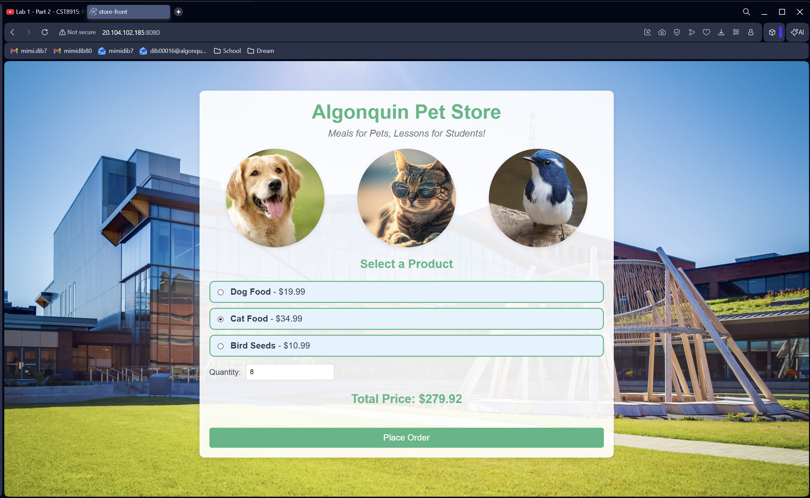
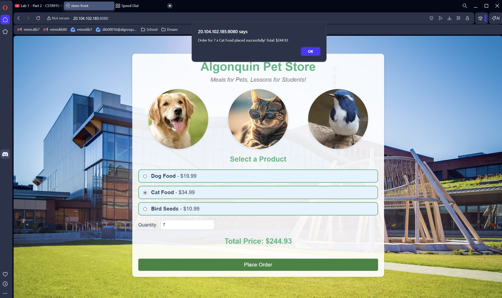
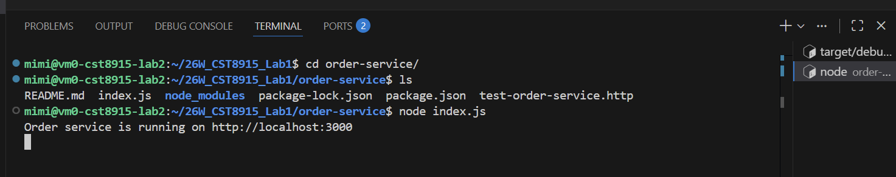
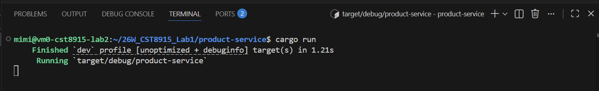
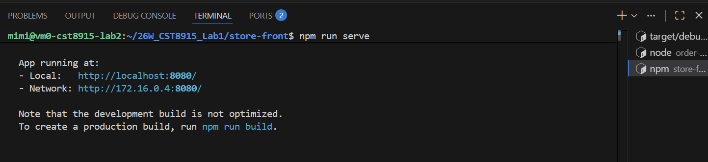
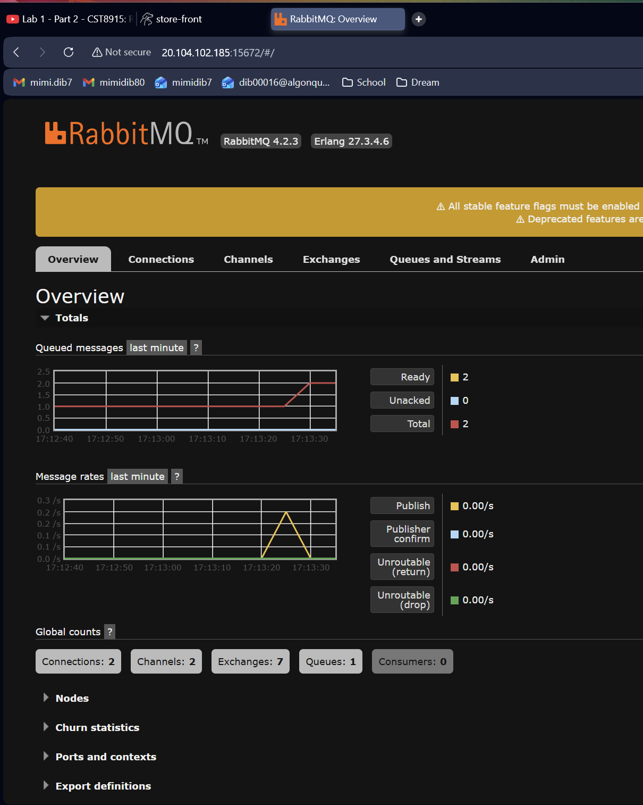
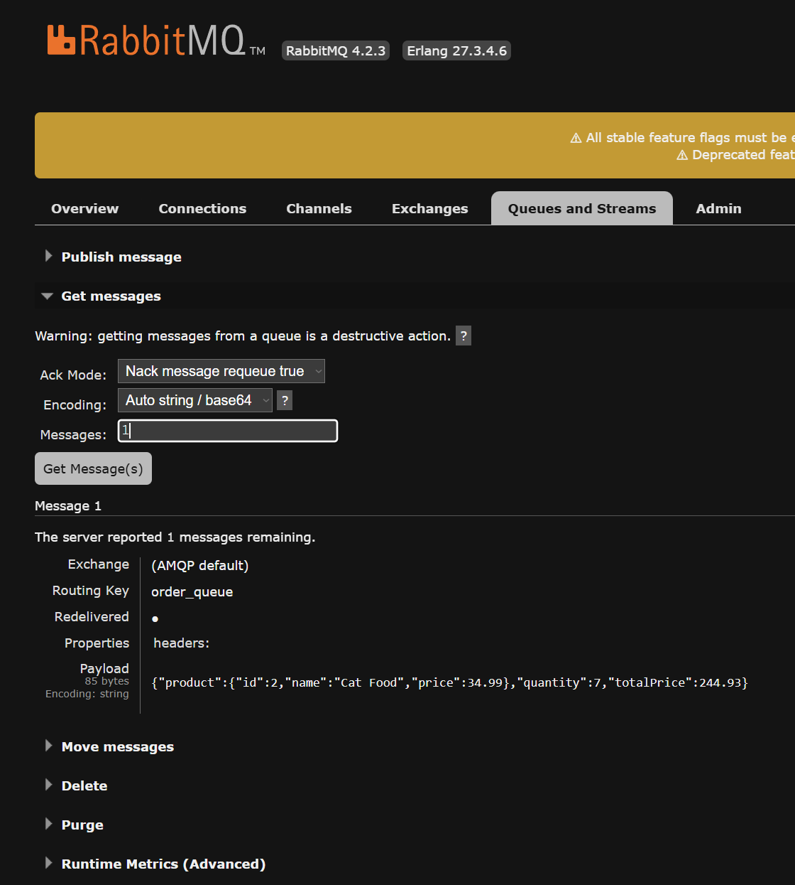

# CST8915 Lab 1: Algonquin Pet Store on Azure VM

**Student Name**: Mimi Dib
**Student ID**: 040829779  
**Course**: CST8915 Full-stack Cloud-native Development
**Semester**: Winter 2026

---

## Demo Video

🎥 [Watch Demo Video](https://www.youtube.com/watch?v=7v8hamBHJ8I)

---

## Technical Explanations

### Order Service (Node.js)

[**Note**: I understand the expectation was 1-2 paragraphs for each service technical explanations. I wanted to take this opportunity to solidify my understanding of these tools for future use by diving deeper and test my learning providing more information]

**Purpose: What is this service responsible for?**
    Order service is a Webb APP responsibile for listening and receiving client orders from store-front to send them into a Queue (RabbitMQ) to be processed by any subscribers and notifies clients of a successful order placed.
**Technology Stack: Which language/framework does it use and why?**
- Rabbit MQ using AMQP (Advanced Message Queuing Protocol): A Client library to communicate with RabbitMQ. RabbitMq is a message broker /message queueing software that allows difference microservices to communicate asynchronously. Receieves data or tasks from producers and stores them in queues and delivers them to consumers to provide higher performance, load balancing and reliability.
- CORS (cross-Origin Resource Sharing) is a Browser security feature that APIs MUST implement if to allow for cross-origin requests. Browsers reject cross-origin requests by default (same-origin policy) to prevent malicious websites from making unauthorized API requests using your logged-in session and possibly accessing your data on other sites and doing other malicious activity on your behalf.
- Express js is a simple framework to create Web APPs in JS (like Flask)

**Architecture Role: How does it fit into the microservices architecture?**
Each Service can be deployed independently from other services, contains different dependency files and runtimes, and is not closely coupled with Product-Service, RabbitMQ or Store-front. Order-service is its own application that could be easily put into its own repository with minimal pipeline changes. 
RabbitMQ Helps to create a microservice architecture by decoupling services from eachother so they don't need to know each other to exist to function and communicate and move on without waiting for a process to complete.

**Inter-Service Communication: How does it interact with other services?**
- RabbitMQ's How: In the API that sends a message (for the subscriber which, within order-service we have no idea who that is) We require the library, and set the url and connect to the RabbitMQ server (in our case on the VM using localhost) where its being hosted. To send a message to the Queue, we declare the channel for us to use to communicate with the Queue to send messages to, and declare said Queue. Then we convert the message aka the order object to a JSON string. We create the Queue (Ensuring we check if it already exists and doesn't persist after restart), and send the message (order object) into the Queue (with logging) and senda response of order received to the client. This now allows any subscribers to get notified of the order being sent, without order-service waiting for any subscribers to finish processing the request or even knowing any subscribers exist. From the order-service we don't even see what services use this order we sent, confirming our decoupling aspect of microservices further.

- CORS' How: CORS works by using 2 types of requests: simple requests and non-simple requests (preflight). Depending on the type of request action and content type. APIs must add CORS headers if they want browsers to access them. If an API will allow browsers to use it using Express with CORS middleware it must allow specific origins specifying either `app.use(cors())` to accept all origins- specifically for dev, OR for prod specify:
1. The `origin` - allwos origins 
2. `methods` permitted specific actions 
3. `credentials:true` if using cookies/auth
[I believe for non-simple requests we require setting the headers more explicity. Using Express and CORS allows for non-simple CORS processing *BEFORE* each requests and sends the CORS headers in each request rather than *AFTER* using an OPTIONS route handler for every endpoint]  

### Product Service (Rust)

**Purpose: What is this service responsible for?**
Product-Service is a high-performing API web service used to provide the catalog of static pet products.  
**Technology Stack: Which language/framework does it use and why?**
- Rust: programming language. Good for coding high-performance web applications ensuring memory safety and security. It helps ensure easier and safe concurrent coding.
- Warp Web Framework: A lightweight modular web framework. Good for building web services and APIs in Rust. Since its written in Rust it prioritizes high performance and safety.
    - Filter: a core building block to handle HTTP Requests. It extract data, validate inputs or return responses. Where we use it: 1. `warp::path("products")` is a filter to match the incoming request path to "products" or rejects the request if the path is not matching, and 2. `warp::cors()` is a filter used in defining the `cors` variable used on the `/products` path via `.with(cors)` indicating this route can accept cross-origin requests based on the attributes of `cors` variable
- Tokio Runtime initialized the main function as asynchronous. Handles scheduling and asynchronous I/O operations
    -By default, `main` cannot be `async`. It allows the service to receive an initial request, pause by creating a "Future" object that represents the paused task (it acts as a contract saying it will pause this request until any dependent information is facilitated e.g. retrieving info from a db) using `.await` and continue processing other requests for other products until the initial request can be returned with any dependent data recieved using `.run()`. 
- CORS: in product-service it allows requests from any domain, restricting method-types to white-list only "GET" methods.  

**Architecture Role: How does it fit into the microservices architecture?**  
Product-service is a web app that serves the simple purpose of providing a list of the available products.  
It serves a list of static products to any and all who request it, without being tied tightly to other serivces within the pet-store repository. It decouples the products data from teh rest of the system allowing other parts to stay independent and can be deployed independently as its runtime (Tokio) is separate, and even uses entirely different languages from the rest of the repository.   

**Inter-Service Communication: How does it interact with other services?**
- Product-Service listens for any and all incoming requests and routes them to the `/products` path
- Receives requests from any domain (in our case this is the front end of our AC pet store website) via `.with(cors)`, indicating the `/products` path facilitates cross-origin requests
- Sends the request back in an asynchronous manner, not needing to know anything about other services.

### Store Front (Vue.js)

**Purpose: What is this service responsible for?**
Store front is a User Interface (UI) that displays the pet store web page, fetching data from Backend service Product Service to display the products, calculates order totals, and takes & sends orders to the back end Order Service upon client order.  

**Technology Stack: Which language/framework does it use and why?**
- Vue.js: A JavaScript framework used for its reactive data-binding and component-based architecture. It has features like compute properties, that we use for `totalPrice` to calculate and return product price * quantity if truthy (if its not null, false, 0, undefined, etc) else returns 0 *without refreshing the page*
- Fetch API is used to handle asynchronous communication with backend services 
- 
**Architecture Role: How does it fit into the microservices architecture?**
The pet store front end ui store-front facilitates the visual contents and presents data from multiple independent places without coupling itself to them. It runs separately from the other serivces it retrieves data from, and can be put into an entirely different repository, and deployed separately as all its dependencies are isolated from the other services.
Notes on the parts of this service:
- Vue.js is the main Vue component that contains the store itself
- main.js starts the Vue app
- pack.json lists dependencies
- babel.config.js is a Javascript setting for compatability
- jsconfig.json is another JS file, this time for configurations
- package-lock.json is just for dependency versions

**Inter-Service Communication: How does it interact with other services?**
Store-Front talks to both Product-Service & Order-Service:
- an async `fetchProducts()` method uses`fetch('http://20.104.102.185:3030/products')` to perform a GET to the `/products` path of the OrderService on the VM's public ip & port for Product-Service (Allowed because of CORS)
- another async `submitOrder()` method uses `fetch('http://20.104.102.185:3000/orders'` perform a POST to the `/orders` path of Order-Service (allows because of CORS) on the VMs public ip & port for Order-Service (Allowed because of CORS)

---

## Challenges and Learnings (Optional)

[Share any interesting challenges you faced during setup, how you solved them,
and what you learned from this lab experience]
The only actual issue I ran into was pretty funny. During VM setup, specifically connecting to the VM via vscode I had a 'Failed to connect' error. At my last job we ssh'ed into our assigned servers every day, and never had to think about the server management layer, meaning I never needed to turn it on. In this habit I forgot to turn on my VM before SSH-ing into it via VSCode. It was a quick realization 'forehead' moment before turning it on and connecting.
Everything else was very smooth. 

---

# Lab 1 Screenshots

## Store Front Application

*Store front interface showing Cat Food selected with quantity and total price*

*Web interface of the pet store with product selection and order form confirming order*

## Running Services

*Node.js order service running on localhost:3000 before changing to VM ip*

*Rust product service running in development mode*

*Vue.js store front running on localhost:8080 before changing to VM ip*

## RabbitMQ Message Queue

*RabbitMQ broker service status showing active running state*

*RabbitMQ management dashboard showing message rates and connection statistics on VM ip*

*RabbitMQ message payload showing order details for Cat Food*